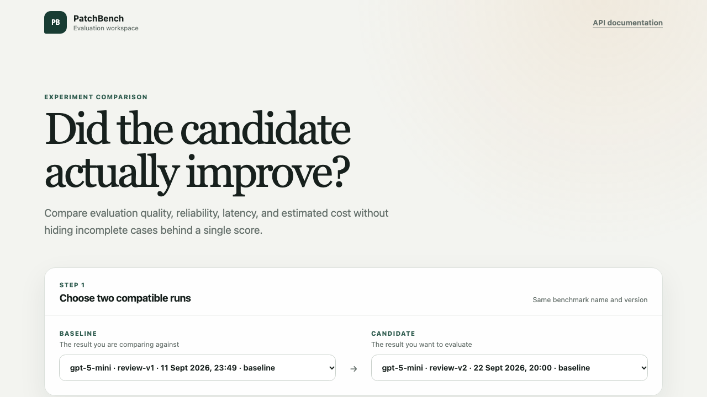
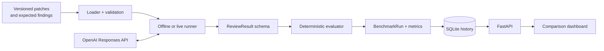

# PatchBench

[](https://github.com/sambalbalado/patchbench/actions/workflows/ci.yml)
[](https://www.python.org/downloads/)
[](LICENSE)

PatchBench is a reproducible evaluation harness for AI code reviewers. It answers a practical
question: **does an AI reviewer find real defects without inventing new ones?**

It runs labeled code patches through either saved predictions or a real OpenAI model, then measures
detection accuracy, category accuracy, location accuracy, false-positive rate, latency, token usage,
and estimated cost.

**[Open the live PatchBench comparison dashboard](https://patchbench-demo.onrender.com/)**

The public demo is read-only: it presents the two versioned baselines without exposing an API key
or allowing visitors to create paid model runs. The free service may need a short warm-up after a
period of inactivity.

## 75-second project demo

[](docs/demo/patchbench-demo.mp4)

**[Watch the narrated PatchBench walkthrough](docs/demo/patchbench-demo.mp4)** ·
[Read the accessible transcript and evidence notes](docs/demo/transcript.md)

The walkthrough uses the public read-only dashboard and the repository's two versioned baseline
results. It shows the benchmark method, measured improvements, and case-level evidence without
creating a new paid model run.

## Why PatchBench

AI code-review demos often show a handful of successful findings but do not measure false alarms,
failed requests, or cost. PatchBench turns that demo into a repeatable evaluation:

1. Load a versioned set of patches with known answers.
2. Obtain a structured review from saved predictions or an OpenAI model.
3. Validate every response against one strict schema.
4. Score bug detection, category, file, and line while tracking false positives separately.
5. Preserve latency, usage, cost, and failures so two runs can be compared honestly.

The 24-case corpus is deliberately balanced: 12 patches introduce defects and 12 are safe. A
reviewer therefore cannot score well merely by reporting a problem for every change.

## Results at a glance

Both published runs used `gpt-5-mini`; the candidate used the audited `review-v2` prompt and label
contract. These are observed results on this corpus, not a general model-quality claim.

| Metric | `review-v1` | `review-v2` |
| --- | ---: | ---: |
| Completed cases | 24 / 24 | 24 / 24 |
| Seeded bugs detected | 12 / 12 | 12 / 12 |
| Detection accuracy | 83.3% | 91.7% |
| False-positive rate | 33.3% | 16.7% |
| Overall rubric accuracy | 83.3% | 96.7% |
| Average latency per case | 16.59 s | 10.62 s |
| Estimated run cost | $0.04372975 | $0.04523200 |

Read the [portfolio benchmark report](docs/benchmark-report.md) for the scoring method,
interpretation, threats to validity, and links to the versioned raw results.

## Architecture

PatchBench separates benchmark data, model I/O, deterministic scoring, persistence, and
presentation. The CLI and API share the same loader, response schema, evaluator, and live runner;
the dashboard only reads persisted results and computes presentation-level comparisons.



The [architecture guide](docs/architecture.md) explains the execution paths, persistence boundary,
public read-only deployment, and the reasoning behind those separations.

## Quick start

PatchBench requires Python 3.11 or newer.

```bash
python -m venv .venv
source .venv/bin/activate
pip install -e '.[dev]'
```

## Offline prediction mode

Offline mode is deterministic, free, and remains the default. It validates every saved prediction
against `ReviewResult` before scoring it.

```bash
patchbench
# Equivalent explicit command:
patchbench --benchmark benchmark --predictions examples/predictions.json
```

The prediction file must be a JSON object keyed by benchmark case ID. See
`examples/predictions.json` for the complete format.

## Real OpenAI review mode

Create an API key, choose a model that supports Structured Outputs, and export both values. The
example model can be replaced without changing code.

```bash
export OPENAI_API_KEY="your-api-key"
export PATCHBENCH_MODEL="gpt-5-mini"
patchbench --benchmark benchmark --openai --smoke-case division_by_zero \
  --max-concurrency 4 --max-retries 1
```

You can copy `.env.example` as a reminder of the required variable names, but PatchBench does not
load `.env` files itself. The API key is read from the process environment, passed directly to the
OpenAI SDK, and is never written to results or printed.

Live mode sends each `patch.diff` to the OpenAI Responses API with bounded concurrency. Four
requests may run at once by default; `--max-concurrency` accepts values from 1 through 8. This
conservative ceiling speeds up experiments without allowing an accidental burst of unbounded paid
requests. The SDK constrains each response to the existing `ReviewResult` Pydantic schema, and
PatchBench validates it again before scoring. Requests set `store=False`, and each completed case
includes `latency_ms`, input tokens, cached input tokens, output tokens, and estimated cost.

Use `--smoke-case CASE_ID` to review one named case before starting the concurrent batch. A
successful smoke result is reused in the final summary, so that case is not purchased twice. If the
smoke request fails, PatchBench reports that failure and marks every other case as skipped without
sending more requests.

The live JSON result records its concurrency, timeout, and retry configuration; the original
`case_order`; separate completed, failed, and skipped counts; structured per-case failures; skipped
case IDs; and an aggregate summary for completed cases. Workers may finish in any order, but
completed scores and failures are restored to benchmark order before output. One failed request
therefore does not discard successful reviews from other cases. The summary records the model,
prompt version, average latency, aggregate token counts, total estimated cost, and coverage counts
showing how many completed cases supplied usage and pricing data. Offline cases use `null` for
operational metrics because no model request occurred.

Each live request has a 60-second timeout and allows one retry by default. Retry selection
and exponential backoff are handled by the official OpenAI Python SDK: connection failures, request
timeouts, HTTP 408 and 409 responses, rate limits, and server errors are retryable. Invalid
structured responses, authentication failures, permission errors, and ordinary bad requests are
not retried. Use `--max-retries 0` for exactly one attempt per case, or `--max-retries 2` when
reliability matters more than the extra attempt. PatchBench caps this setting at two because retries
can increase runtime and may create additional paid requests.

Cost estimates use the standard per-million-token rates published in the
[official GPT-5 Mini model documentation](https://developers.openai.com/api/docs/models/gpt-5-mini),
recorded in the output with their source and an `as_of` date. PatchBench currently estimates cost
for `gpt-5-mini` and `gpt-5-mini-2025-08-07`. Other models still report token usage, but cost remains
`null` until a reviewed pricing entry is added; this avoids silently applying the wrong rate.

A timeout, API failure, refusal/missing structured output, or schema validation failure that remains
after the configured retry policy becomes a structured failure containing its case ID, error type,
message, and elapsed request time when available. Live mode makes at least one paid model request per
discovered benchmark case, so review the benchmark directory and retry setting before running it.

## Run API

PatchBench also exposes live execution and saved history through FastAPI. Load the local environment
before starting the server; `.env` remains ignored by Git and is never read into API responses.

```bash
set -a
source .env
set +a
export PATCHBENCH_SOURCE_COMMIT="$(git rev-parse HEAD)"
patchbench-api
```

The comparison dashboard is available at `http://127.0.0.1:8000/`, and the interactive API
documentation remains available at `http://127.0.0.1:8000/docs`. The dashboard automatically
selects the two most recent compatible completed runs and shows raw values, explicit deltas,
direction labels, and completion coverage. Its case table aligns results by case ID, separates
quality changes from execution failures, and expands to show scoring, latency, cost, and error
evidence. A run starts with a small request that names the model and bounded execution settings:

```bash
curl -X POST http://127.0.0.1:8000/runs \
  -H 'content-type: application/json' \
  -d '{"model":"gpt-5-mini","max_concurrency":4,"max_retries":1,"smoke_case":"division_by_zero"}'
```

The response is `202 Accepted` with a generated run ID. Poll `GET /runs/{run_id}` for `queued`,
`running`, `completed`, or `failed`, then read the persisted case outcomes and derived summary from
`GET /runs/{run_id}/results`. `GET /runs?status=completed&limit=50` lists selectable runs newest
first; status is optional and the limit must be between 1 and 100. Request handlers never wait for
the benchmark: a separate executor runs the paid model calls while status requests use independent
SQLite connections. By default, history is stored in `results/patchbench.db`;
`PATCHBENCH_DATABASE` and `PATCHBENCH_BENCHMARK` can override the database and benchmark paths. The
API key stays in the server process environment and is not part of the JSON contract.

## Read-only public demo deployment

The live demo is available at
[patchbench-demo.onrender.com](https://patchbench-demo.onrender.com/). The repository includes a
Render Blueprint and GitHub Actions workflow for this safe public environment.
`render.yaml` disables live benchmark creation, omits the OpenAI key, and seeds SQLite from the two
committed baseline results whenever the service starts. The dashboard and saved-result endpoints
remain available, while `POST /runs` returns `403` so a visitor cannot spend API credits.

See the [deployment and rollback guide](docs/deployment.md) for the hosting model, free-tier
limitations, account-side launch steps, smoke test, and the security requirements for ever
enabling live runs on a hosted service.

The deployed health contract is intentionally small:

```bash
$ curl https://patchbench-demo.onrender.com/health
{"status":"ok","database":"ready","live_runs_enabled":false}
```

## Documentation

- [Architecture and data flow](docs/architecture.md)
- [Portfolio benchmark report](docs/benchmark-report.md)
- [Benchmark coverage matrix](docs/benchmark-coverage.md)
- [Label audit and category contract](docs/label-audit-2026-09-20.md)
- [Experiment-history schema](docs/experiment-history-schema.md)
- [Run-comparison experience](docs/run-comparison-experience.md)
- [Deployment, smoke test, and rollback](docs/deployment.md)

## Benchmark format

Each case contains a code patch and its expected finding:

```text
benchmark/
  division_by_zero/
    patch.diff
    expected.json
```

Safe patches are deliberately included. Without negative examples, a reviewer that reports a bug
for every change could appear successful.

The bundled benchmark now contains 24 Python patches, balanced between 12 defect-introducing and
12 safe changes. The positive cases cover distinct correctness, reliability, and security
categories including off-by-one behavior, mutable defaults, missing awaits, data loss, cache-key
collisions, SQL injection, path traversal, authorization bypass, sensitive-data exposure, unsafe
deserialization, and weak randomness. The safe cases include ordinary refactors as well as
security-hardening changes, which tests whether a reviewer understands the direction of a change
rather than merely reacting to security-sensitive code.

The [benchmark coverage matrix](docs/benchmark-coverage.md) classifies every case by technical
area and difficulty, records the exact expected finding, and defines deliberate targets for a
possible 30-case corpus. Its machine-readable source is
[`benchmark/coverage.json`](benchmark/coverage.json). Tests keep that metadata synchronized with
the case directories and `expected.json` labels.

The [2026-09-20 label audit](docs/label-audit-2026-09-20.md) independently reviews all 24 expected
answers. It also defines the canonical finding-category vocabulary used by the model response
schema and documents corrections made to ambiguous safe patches.

### Adding a benchmark case

Create a uniquely named directory under `benchmark/` and add both files. For a positive case,
`expected.json` must provide `category`, `file`, and `line`; the location must identify an added
line in `patch.diff`. For a safe case, all three fields must be `null`. Every patch must be a
well-formed unified diff with accurate hunk line counts.

The loader validates these rules before any prediction is scored or paid model request is made.
Add a matching entry to `examples/predictions.json` if the case should work with the default
offline demonstration.

## Development checks

All automated model tests use mocked clients and make no network or paid API calls.

```bash
pytest
ruff check .
node --test tests/dashboard_logic.test.js
```

## Design choices

- Offline and live execution are separate CLI modes but share the same loader, schema, evaluator,
  and output format.
- The bundled corpus is balanced between positive and negative cases and uses a distinct category
  for each current positive case.
- Ground-truth file and line labels are checked against parsed unified diffs during loading.
- Coverage metadata is schema-validated and checked against every bundled case and label.
- Finding categories are enum-constrained so wording differences cannot silently distort scores.
- Review results require complete finding details for bugs and prohibit contradictory details on
  safe decisions.
- `ReviewResult` is the single response contract. Extra fields and invalid field values are
  rejected rather than silently accepted.
- The model name is environment configuration so experiments can change models without code edits.
- Prompt and pricing versions are included in live summaries so benchmark runs remain interpretable.
- Latency uses a monotonic clock around every request and is retained even in raised request errors.
- Live requests use a bounded thread pool because model calls spend most of their time waiting for
  network I/O; result ordering is reconstructed after workers finish.
- The OpenAI SDK owns retry classification and backoff, while PatchBench limits the retry budget and
  turns exhausted failures into case-level records.
- Experiment history uses versioned SQLite migrations with normalized run and case-result tables.
  Aggregate metrics come from a database view so stored summaries cannot drift from case records.
- A focused history repository atomically stores complete runs and reconstructs typed results by run
  ID. Persistence stays opt-in, so existing offline and live CLI execution remains database-free.
- FastAPI handlers validate run settings and delegate lifecycle changes to the history repository;
  they contain no SQL. Background execution keeps status and result reads responsive during a run.
- The comparison dashboard is served from the same FastAPI process, uses the existing run-list and
  result endpoints, and computes presentation-only deltas in a dependency-free browser client.
- Case comparisons align by stable case ID rather than result position. Missing, failed, and skipped
  outcomes remain explicit instead of receiving invented scores.

## First real baseline

The first complete live run evaluated all 24 bundled cases with `gpt-5-mini` and prompt
`review-v1`. It detected all 12 seeded bugs, produced four false positives across the 12 safe
patches, completed without API failures, and cost an estimated $0.04373. See the
[baseline report](docs/baseline-2026-09-11.md) and
[machine-readable result](results/gpt-5-mini-review-v1-baseline-2026-09-11.json) for the full
metrics and case-level scores.

## Audited `review-v2` baseline

The 2026-09-22 validation run completed all 24 audited cases without API or parsing failures. It
detected all 12 seeded bugs, reduced false positives from four to two, and matched the canonical
category, file, and line on every positive case. The run cost an estimated $0.045232. See the
[`review-v2` comparison report](docs/baseline-review-v2-2026-09-22.md) and
[machine-readable result](results/gpt-5-mini-review-v2-baseline-2026-09-22.json).

## Limitations and responsible use

- The corpus contains 24 small, synthetic Python patches. It does not represent every language,
  repository shape, defect type, or production review condition.
- The published comparison is not a controlled prompt-only experiment: the category contract and
  several labels were audited between `review-v1` and `review-v2`.
- Each configuration has one recorded run, so the results do not measure model-to-model variance or
  provide statistical confidence intervals.
- File and line scores measure localization against curated labels with a ±2-line tolerance; they do
  not measure whether a suggested fix is correct or complete.
- Latency and price are point-in-time observations. Provider load and pricing can change, and cost
  estimates are only produced for models with an explicit versioned pricing entry.
- PatchBench evaluates a reviewer; it does not make that reviewer safe to use autonomously. Model
  findings should support human review, not replace it, especially for security-sensitive changes.
- Only code that the operator is authorized to process should be sent to a model provider. Secrets,
  personal data, and proprietary source require the same handling they would receive in any other
  external code-analysis workflow.

## Roadmap

Milestones 1–5 are complete: PatchBench has a real-model baseline, reliable bounded execution, an
audited coverage matrix, a validated `review-v2` comparison, a tested experiment-history API, and a
two-run dashboard with aggregate and case-level evidence. Milestone 6 now has a safe deployment
configuration, continuous testing, and a smoke-tested public demo. The next steps are:

1. Record a concise PatchBench demonstration.

## License

PatchBench is available under the [MIT License](LICENSE).
