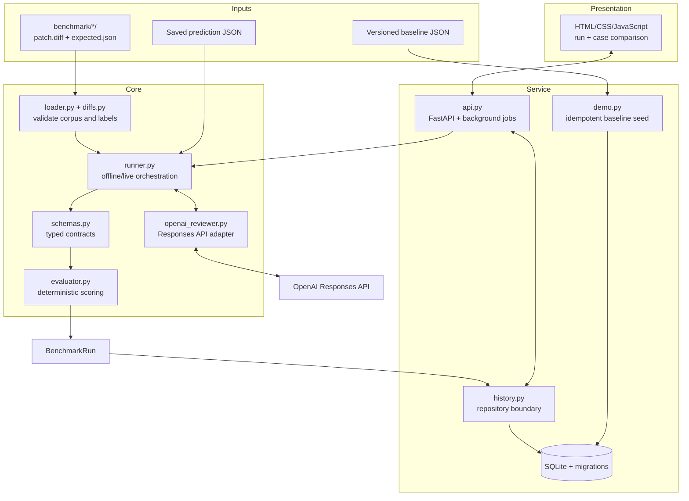
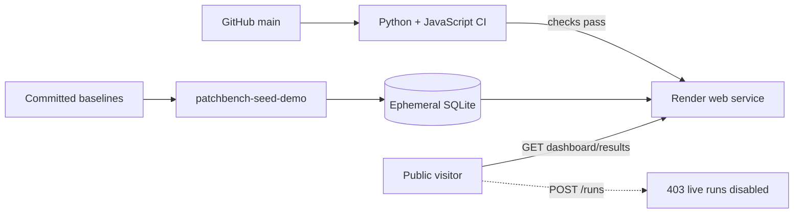

# PatchBench architecture

PatchBench is organized around one rule: model output is untrusted input, while benchmark scoring
must remain deterministic and reproducible. Model communication, validation, scoring, persistence,
and presentation therefore have separate boundaries.

## System overview

## Execution paths

### Offline evaluation

The CLI loads benchmark cases and saved predictions, validates each prediction as a `ReviewResult`,
and passes the typed value to the evaluator. This path is deterministic, free, and is the default
developer demonstration. It does not write experiment history.

### Live evaluation

The live runner sends each patch through `OpenAIReviewer`. The adapter requests a structured
`ReviewResult` with `store=False`, records latency and token usage, and converts provider or parsing
problems into typed failures. A bounded thread pool allows up to eight concurrent requests while
restoring every outcome to corpus order.

An optional smoke case runs first. If it fails, the remaining cases are marked skipped; if it
succeeds, its result is reused rather than purchased twice. Retry selection and backoff stay with
the official SDK, while PatchBench caps the configured retry budget.

### API-managed evaluation

`POST /runs` validates the requested execution settings, stores a queued run, and submits work to a
background executor. Polling and result endpoints open independent SQLite connections, so a model
request does not block status reads. `BenchmarkService` coordinates the lifecycle; HTTP handlers do
not contain SQL.

## Persistence model

`HistoryRepository` is the only application boundary that writes run history. Versioned SQL
migrations create normalized run and case-result tables. Aggregate metrics are derived from stored
case outcomes, preventing a separately stored summary from drifting away from its evidence.

Every run records the benchmark version, source commit, model, prompt version, pricing snapshot,
execution settings, timestamps, failures, and ordered case outcomes. This metadata is what makes a
comparison explainable rather than merely visual.

## Dashboard boundary

FastAPI serves the static dashboard and the JSON endpoints from one origin. The browser requests the
two selected stored runs, aligns case outcomes by stable case ID, and computes display-only deltas.
It does not rescore model output. Missing, failed, and skipped outcomes remain visible instead of
being converted into invented scores.

## Public deployment

The public Render service sets `PATCHBENCH_ALLOW_LIVE_RUNS=false` and has no OpenAI key. On each
start, the idempotent seed command reconstructs SQLite from the two committed baselines. This makes
ephemeral storage acceptable for the demonstration while ensuring that public traffic cannot spend
API credits.

## Why these boundaries matter

- **Typed model boundary:** malformed or contradictory reviews fail validation before scoring.
- **Deterministic evaluator:** the same case and review always receive the same score.
- **Failure isolation:** one provider failure does not erase successful case outcomes.
- **Repository boundary:** API lifecycle code stays independent of SQL details.
- **Read-only public mode:** portfolio access does not imply permission to purchase model calls.
- **Versioned evidence:** reports and the dashboard trace back to raw JSON and source commits.
